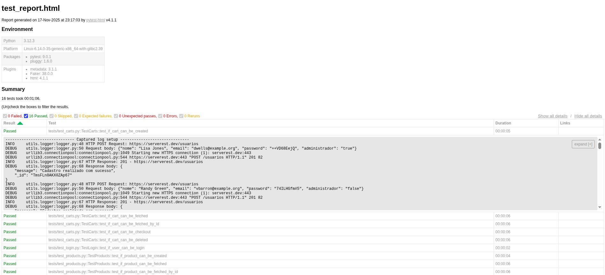

# ServeRest API Test Automation

API test suite for [ServeRest](https://serverest.dev) - a REST API for e-commerce testing scenarios.

## Quick Start

```bash
# Install dependencies
make install

# Run tests
make test

# Run tests with HTML report
make test-html
```

## Versioning & Releases

- Current version: **0.1.0**
- See `RELEASE.md` for detailed release notes.

## Tech Stack

**Core packages:**
- `pytest` - testing framework
- `requests` - HTTP client
- `assertpy` - fluent assertions
- `faker` - test data generation
- `pytest-html` - HTML reports with logs
- `python-dotenv` - environment configuration
- `uv` - Python package manager

**Development tools:**
- `ruff` - linter and formatter (replaces flake8 + black + isort)

## Project Structure

### Services Layer (`services/serverest_api/api/`)
API client abstraction - each endpoint has its own class:
- `users.py` - user CRUD operations
- `products.py` - product management (requires admin token)
- `carts.py` - shopping carts and checkout
- `login.py` - authentication

### Utils Modules (`utils/`)
- `logger.py` - custom logger for HTTP requests/responses (saves to files + outputs to HTML report)
- `request.py` - wrapper over requests with automatic logging
- `data_generator.py` - test data generation via Faker
- `file_manager.py` - JSON test data file operations
- `calculator.py` - business logic (cart calculations)

### Tests (`tests/`)
- `conftest.py` - pytest fixtures for test data setup
- `test_*.py` - test files for each module

## Implementation Details

### Fixture-based Test Infrastructure
Uses pytest fixtures for test data management:
- `create_user` - creates users before tests
- `login_user` - logs in users and stores tokens
- `create_product` - creates products (requires admin)
- `create_cart` - creates carts with products
- `context` - shared state between tests

### Dual Logging
- **File logging**: detailed HTTP requests/responses in `logs/*.log` for debugging
- **HTML reports**: test logs displayed in pytest-html reports

Logging is integrated at the HTTP client level - all requests are automatically logged.

### Data-driven Approach
Test data is generated dynamically via Faker, but also saved to JSON for reuse. Number of test objects can be configured via environment variables.

### Soft Assertions
Uses `soft_assertions()` from assertpy - allows checking multiple conditions in one test without stopping on first failure.

## Linting and Formatting

Project uses **Ruff** - a fast Rust-based linter that replaces flake8, black, isort and other tools.

```bash
# Check code
make lint

# Auto-fix issues
make fix

# Format code
make format
```

Ruff is configured with rules:
- pycodestyle (E, W)
- pyflakes (F)
- isort (I)
- pep8-naming (N)
- pyupgrade (UP)
- flake8-bugbear (B)
- flake8-comprehensions (C4)
- flake8-simplify (SIM)

## Docker

Project is containerized for consistent test execution:

```bash
# Build image
make docker-build

# Run tests in Docker (headless)
make docker-test

# Run tests in Docker with HTML report
make docker-test-html

# Open shell in container
make docker-shell

# Clean up Docker resources
make docker-clean
```

Dockerfile uses Python 3.11 slim image and uv for fast dependency installation.

## Reports and Logs

**HTML Reports** (`reports/test_report.html`):
- Detailed information about each test
- Execution logs (logger.info/debug)
- HTTP requests and responses, including request bodies when present
- Embedded excerpts from `logs/log_*.log` per test for offline debugging
- Filter by test status

**File Logs** (`logs/log_*.log`):
- Complete HTTP interaction information
- Timestamp for each request
- Headers, cookies, request/response bodies

## Test Execution Examples

### HTML Report Example

Generated HTML report (`reports/test_report.html`) provides a comprehensive view of test execution:



The report includes:
- Test execution summary with pass/fail statistics
- Environment details (Python version, platform, packages)
- Detailed logs for each test with timestamps
- HTTP request/response details with request bodies
- Embedded file logs for each test
- Expandable test details for troubleshooting

### Log File Example

Each HTTP request and response is logged with detailed information in `logs/log_*.log`:

```
-----
Test: tests/test_carts.py::TestCarts::test_if_cart_can_be_created (setup)
Time: 2025-11-17 23:05:12.803703
Request method: POST
Request URL: https://serverest.dev/usuarios
Request headers: {'Content-Type': 'application/json', 'Accept': 'application/json'}
Request body: {"nome": "Loretta Scott", "email": "shannonfranklin@example.net", "password": "1Op2P%Vj!)", "administrador": "true"}

Response code: 201
Response text: {
    "message": "Cadastro realizado com sucesso",
    "_id": "OkwxK3FQZVJPVyKq"
}
Response headers: {'access-control-allow-origin': '*', 'x-dns-prefetch-control': 'off', 'x-frame-options': 'SAMEORIGIN', 'strict-transport-security': 'max-age=15552000; includeSubDomains', 'x-download-options': 'noopen', 'x-content-type-options': 'nosniff', 'x-xss-protection': '1; mode=block', 'content-type': 'application/json; charset=utf-8', 'x-cloud-trace-context': '325275646c03d47f46340418399f6330;o=1', 'date': 'Mon, 17 Nov 2025 21:05:13 GMT', 'server': 'Google Frontend', 'Content-Length': '82'}
Response cookies: {}

-----
```

Each log entry includes:
- Test name and execution phase (setup/call/teardown)
- Timestamp for precise tracking
- Complete HTTP request details (method, URL, headers, body)
- Complete HTTP response details (status code, headers, body, cookies)
- Request/response separation for easy navigation

## Configuration

Configuration via environment variables in `.env` or `config.py`:
- `BASE_URI` - API base URL
- `MAX_USERS_COUNT` - number of users for tests
- `MAX_PRODUCTS_COUNT` - number of products
- `MAX_CARTS_COUNT` - number of carts

## Test Coverage

- **Users**: 5 tests (CRUD operations)
- **Products**: 5 tests (CRUD with admin authorization)
- **Carts**: 5 tests (create, get, checkout, delete)
- **Login**: 1 test (authentication)

Total: **16 tests** covering main API scenarios.

## Available Commands

### Setup
```bash
make install       # Install dependencies with uv (including dev tools)
```

### Testing
```bash
make test          # Run test suite
make test-html     # Run tests and generate HTML report
make all           # Install, format, lint, and test (full workflow)
```

### Code Quality
```bash
make lint          # Run Ruff lint checks
make format        # Format code with Ruff
make format-check  # Check formatting without modifying files
make fix           # Auto-fix lint issues and format code
```

### Docker
```bash
make docker-build       # Build Docker image
make docker-test        # Run tests in Docker (headless)
make docker-test-html   # Run tests in Docker with HTML report
make docker-shell       # Open shell in Docker container
make docker-clean       # Remove Docker containers and images
```

### Maintenance
```bash
make clean         # Remove cache artifacts and reports
make help          # Show all available commands
```

---

**API Documentation**: https://serverest.dev
